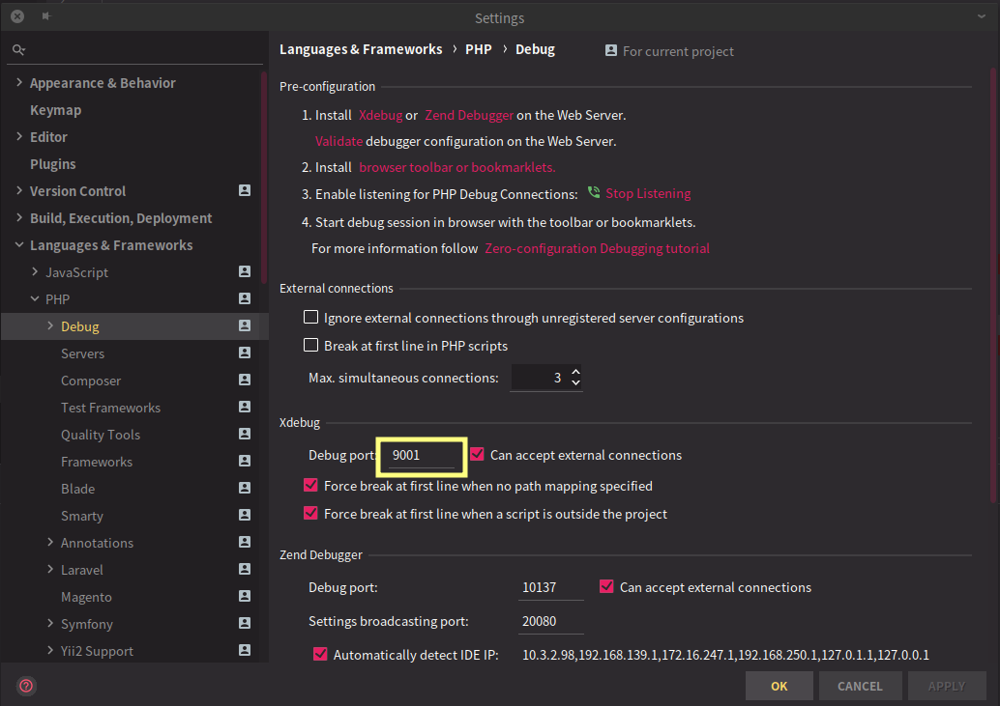
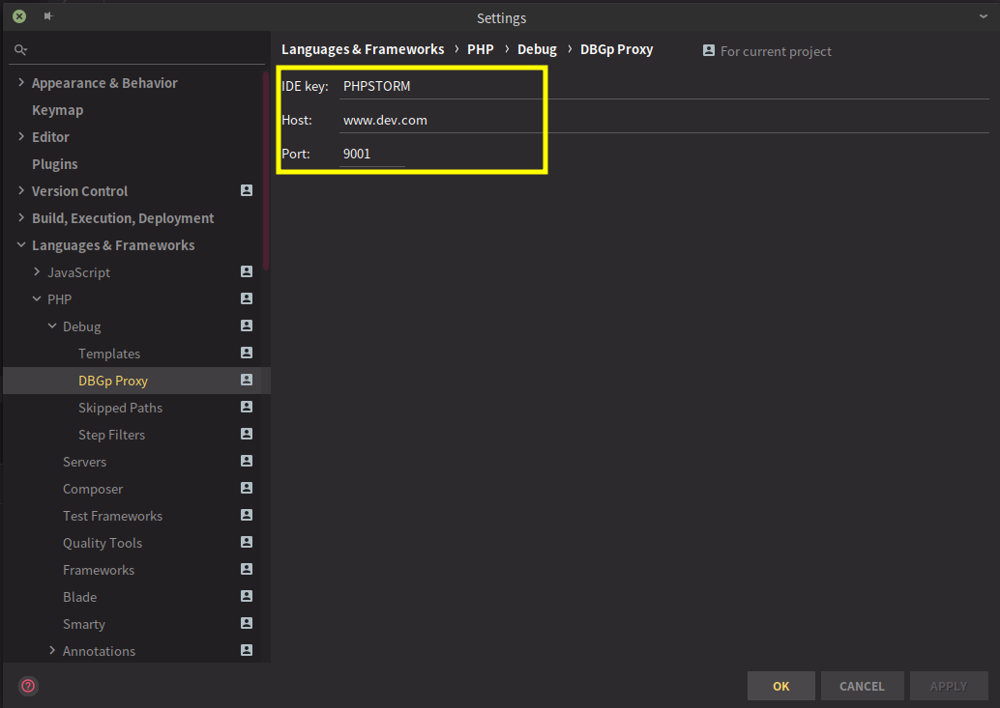
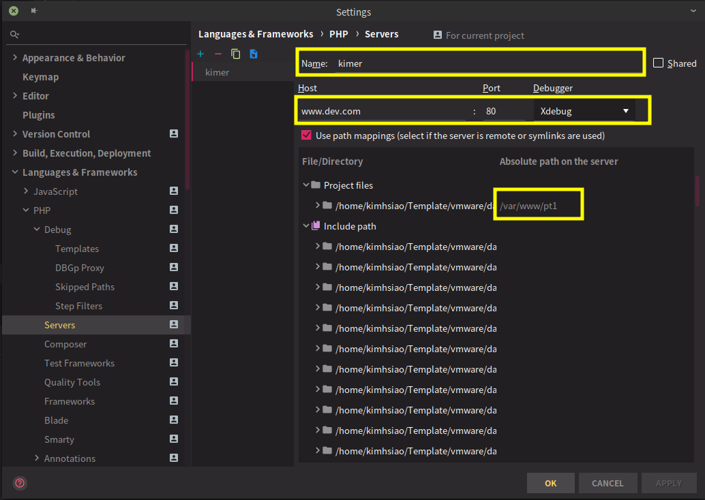

# 如何在 [kdocker] 中，使用 xdebug

> ***註: 這裏只說明預設選項，如果自行調整後壞掉了，請自行負責***

## 環境

> 目前只用在 [IntelliJ-IDEA] ([PhpStorm]) 家族中使用過，其他操作方式應該類似

### [IntelliJ-IDEA] 家族

應該可以應用的環境包括：

- [IntelliJ-IDEA]
- [PhpStorm]
- [WebStorm]
- ...

### [kdocker] 環境

也就是[本專案][kdocker]

## 設定

### [本專案][kdocker]

#### 步驟

1. 設定你自己本身的 `.env` 環境，主要應該是從根目錄的 `env-default` 輔助產生的
1. 確定你的 `PHP_FPM_INSTALL_XDEBUG` 設定爲 `true`
    > `PHP_FPM_INSTALL_XDEBUG` 設爲 `true` 時，才會真的開啓 **xdebug** 功能
1. 調整 `WORKSPACE_PHP_XDEBUG_PORT` 或是 `PHP_FPM_PHP_XDEBUG_PORT`
    > 如果你主要是使用 web 操作 (php-fpm) 時，則參照 `PHP_FPM_PHP_XDEBUG_PORT` 的 port 號，如果是 cli 操作的 (workspace)，則參照 `WORKSPACE_PHP_XDEBUG_PORT` 這個 port 號，當然，這兩個 port 號 *不應該* 相同，或是與其他 port 重複
1. 根據需求，調整 *php-fpm* 和/或 *workspace* 資料夾中的 ***xdebug.ini*** 這個檔案 (optional)
    > 注意，不要調整 `xdebug.remote_port` 這個參數，一旦改了，相關的 port 號就不對了

> ***再次強調：這裏主要說明預設選項，如果自行調整後無法使用，請自行負責***

### [IntelliJ-IDEA]

#### 步驟

1. 設定連線到遠端 `Docker` 環境，也就是連到[本專案][kdocker]的 `Docker` 環境
    > 這邊先不贅述，可以參考其他網路上的教學說明
1. 設定遠端 docker 的 **xdebug** 的 port 號
    > 這個 port 號主要是要看我們先前使用的主要開發環境所設的 port 號，在此我們使用的是 web 操作，所以主要是參考 `PHP_FPM_PHP_XDEBUG_PORT` 的設定值，在這裏是 ***9001***
    >
    > 
1. 設定相關 xdebug 的 server 環境
    > - 其中的 *IDE Key* 就設定爲 `PHPSTORM` (這是預設值)
    > - ×Host* 就是連接到你的 [kdocker] 中 web server 的位址，可以是 ip、hostname 或是 domain name，只要連得到就好
    > - *Port* 號仍然是你剛才設定的 **xdebug port** 。在這裏仍然設定 ***9001***
    >
    > 
1. 設定 *xdebug* 與開發環境相關對應的位置
    > - *Name* 預設的設定值使用 `kimer`，這也是 `.env` 環境中 `PHP_IDE_CONFIG` 這個設定值中 `serverName` 指定的值，在此是 `kimer` (一般 [Intellij-IDEA] 相關設定都可以隨意給設定名稱，但是這裏的設定，一定要與 `PHP_IDE_CONFIG=serverName` 指定的值相同，否則 ***xdebug*** 沒辦法正常運作 ***非常重要、非常重要、非常重要***)
    > - *Host* 與剛才前一步設定的方式相同，就是連接到 [kdocker] 中 web server 的位址，可以是 ip、hostname 或是 domain name，只要連得到就好
    > - *Absolute path on the server* 這是指在遠端 server (也就是 [kdocker] 中的) 的絕對路徑，這裏我們使用的是 pt1 相關設定，所以我們設爲 `/var/www/pt1`
    >
    > 

[intellij-idea]: https://www.jetbrains.com/idea/ "Intellij-IDEA"
[PhpStorm]: https://www.jetbrains.com/phpstorm/ "PhpStorm"
[WebStorm]: https://www.jetbrains.com/webstorm/ "WebStorm"
[kdocker]: https://github.com/poyhsiao/kdocker "kdocker"